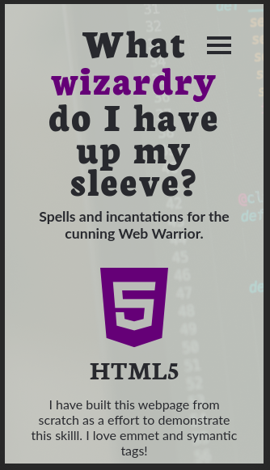
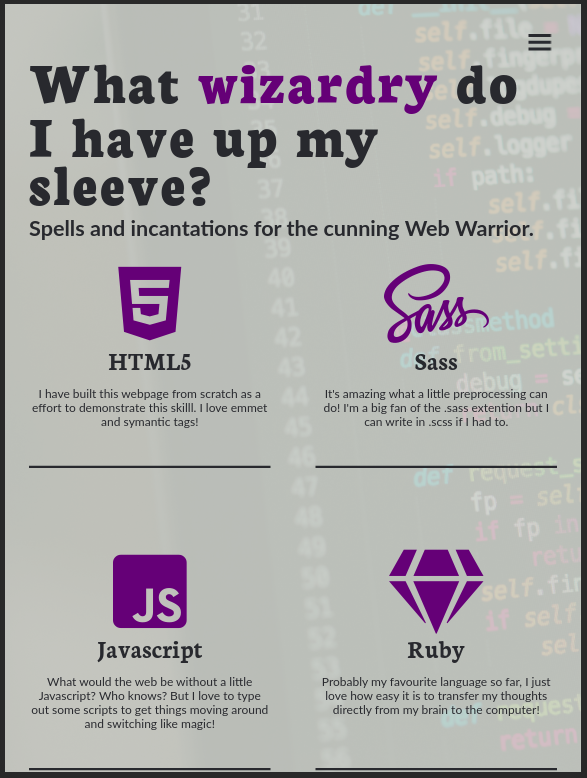
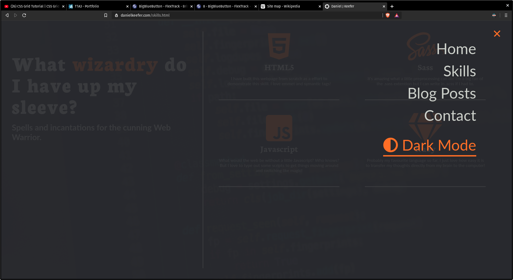
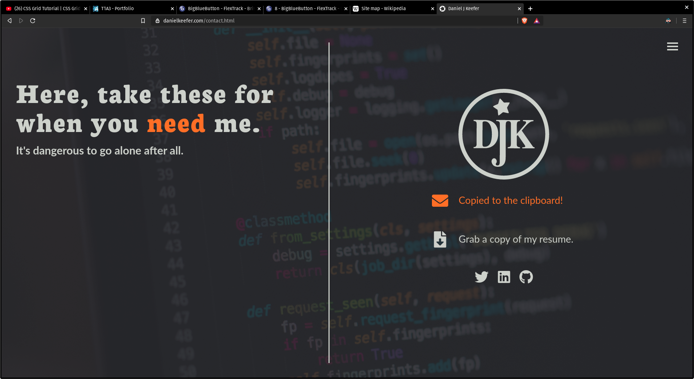
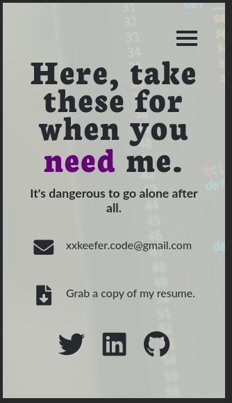

###DanielKeefer_T1A3
###### Weblink - https://www.danielkeefer.com
###### Github Repo - https://github.com/xxKeefer/portfolio
---
# Daniel Keefer's Portfolio website
######////// Purpose
The purpose of this particular website is to demonstrate to my educators and potential employers my grasp of website development. It demonstrates my proficiency with the tech stack used and my ability to build a responsive design with a visually coherent look across the site.

######////// Features
Features include:
 - a mobile responsive design
 - a hamburger menu that slides out when selected and is hidden otherwise
 - a dark theme switcher to give viewers the option
 - a downloadable resume
 - my email address that copies to clipboard when clicked

######////// Tech Stack
HTML, CSS, SASS, Javascript

######////// Sitemap

######////// Screenshots
**Skills page - mobile**

**Skills page - tablet**

**Skills page - desktop**

**Menu / Darkmode - desktop**

**Email to Clipboard - desktop**

**Contact page - mobile**

